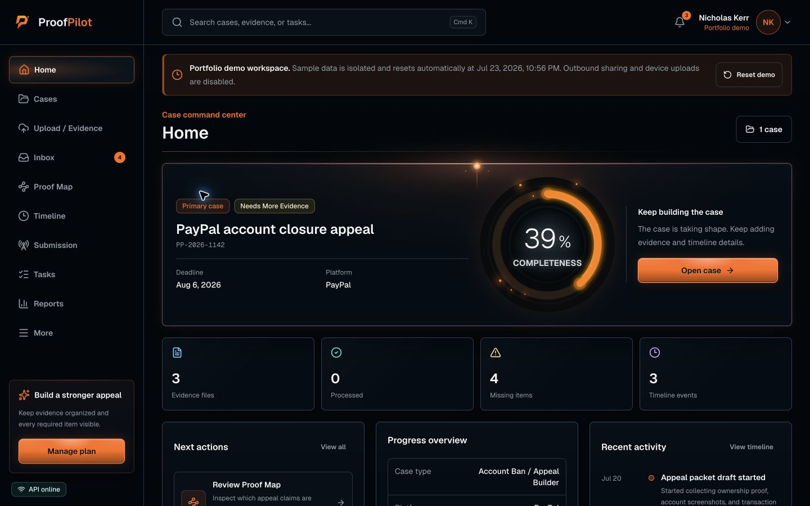
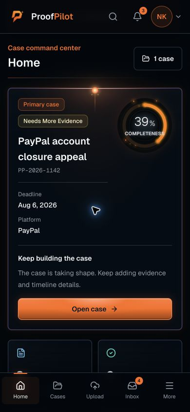

# ProofPilot

ProofPilot is a case-building workspace for organizing evidence, reconstructing events, drafting an appeal, and producing a professional PDF packet. The current product is focused on account bans, restrictions, holds, and payment-platform disputes.

The application combines a responsive web interface with an ownership-aware API, private object storage, background document processing, and durable queues. A seeded demo workspace is included so the complete case workflow can be evaluated locally.

ProofPilot organizes user-provided records and workflow information. It does not provide legal representation, guarantee an appeal outcome, or replace advice from a qualified professional.

**Live portfolio demo:** [nicholas-kerr-proofpilot.vercel.app](https://nicholas-kerr-proofpilot.vercel.app)

The public demo requires no shared credentials. Each visitor receives an isolated, temporary copy of the Nicholas Kerr sample workspace.

## Product Preview

<table>
  <tr>
    <th width="72%">Desktop command center</th>
    <th width="28%">Mobile command center</th>
  </tr>
  <tr>
    <td valign="top">
      
    </td>
    <td valign="top">
      
    </td>
  </tr>
</table>

## Contents

- [Product Preview](#product-preview)
- [What ProofPilot Does](#what-proofpilot-does)
- [Core Capabilities](#core-capabilities)
- [Architecture](#architecture)
- [Prerequisites](#prerequisites)
- [Local Setup](#local-setup)
- [Configuration](#configuration)
- [Common Commands](#common-commands)
- [Evidence Processing Lifecycle](#evidence-processing-lifecycle)
- [Security Model](#security-model)
- [Portfolio Demo Mode](#portfolio-demo-mode)
- [Testing And Quality Gates](#testing-and-quality-gates)
- [Deployment](#deployment)
- [Current Product Boundaries](#current-product-boundaries)
- [Documentation](#documentation)
- [License](#license)

## What ProofPilot Does

ProofPilot guides a user from scattered records to a structured case packet:

1. Create a private case and record the account or platform involved.
2. Add documents from local files, camera capture, Gmail demo data, or Google Drive demo data.
3. Validate, scan, and process evidence in the background.
4. Review extracted text and document metadata.
5. Build a dated timeline and track missing evidence.
6. Use the Proof Map to connect every appeal claim to evidence, timeline events, and statement language.
7. Manage case tasks, reminders, and collaboration.
8. Draft and version an appeal statement with case-aware guidance.
9. Generate, review, download, and securely share a PDF packet.
10. Record each submission round, platform response, follow-up, and final decision.

Supported evidence formats are PDF, PNG, JPG, JPEG, TXT, DOCX, EML, CSV, and XLSX, with a maximum file size of 25 MB per item.

## Core Capabilities

### Case Management

- Private case creation, status tracking, archiving, and progress summaries
- Case-specific timelines with manual entry, analysis, editing, and ordering
- Missing-evidence checklists with requirement details and completion state
- A claim-level Proof Map with coverage, source excerpts, confidence, and evidence gaps
- Tasks, due dates, priorities, reminders, activity history, and reporting
- Multi-round submission and outcome tracking with response deadlines and immutable updates
- Global search across resources owned by the signed-in user

### Evidence Processing

- Direct uploads, camera capture, and review before submission
- Selective Gmail and Google Drive imports in the seeded demo environment
- Private S3-compatible staging and processed-object storage
- Metadata validation and optional ClamAV malware scanning
- PDF and text extraction, image OCR, DOCX parsing, EML parsing, and CSV/XLSX ingestion
- BullMQ processing jobs with visible status, retry, and failure states

### Writing And Packet Generation

- Guided, case-aware assistance based on records already stored in ProofPilot
- Structured appeal questions and deterministic draft generation
- Immutable statement version history with restore support
- Versioned case summaries
- Queued PDF packet generation with evidence index and supporting documents
- Packet preview, download history, recipient access, and revocation controls

### Collaboration And Communication

- Owner, Editor, and Viewer case roles
- Expiring, single-use collaboration invitations
- Configurable Viewer download access
- Recipient-scoped packet links with one-time email verification and view, comment, or download permissions
- Durable packet-invitation outbox with leases, provider idempotency, suppression, and automatic retries
- Unified Inbox for support conversations and eligible notifications
- Notification preferences, reminders, and transactional email delivery infrastructure

### Account And Workspace

- Registration, login, logout, and password recovery
- Persisted, revocable sessions and password-change session invalidation
- Profile, workspace preferences, security controls, and connected-account metadata
- Demo subscription, invoice history, and usage reporting
- Help center, FAQ content, support requests, analytics, and CSV exports

## Architecture

ProofPilot is a pnpm/Turborepo monorepo with three runtime applications:

```text
Browser -> Next.js web application -> NestJS REST API
                                      |-> PostgreSQL
                                      |-> S3-compatible private storage
                                      |-> ClamAV
                                      `-> Redis / BullMQ -> Worker
                                                            |-> document extraction and OCR
                                                            |-> packet generation
                                                            |-> packet-share and notification email
                                                            |-> reminders
                                                            `-> upload and demo-workspace cleanup
```

| Area | Technology |
| --- | --- |
| Web | Next.js App Router, React, TypeScript, Tailwind CSS |
| API | NestJS, REST, Swagger, class-validator |
| Worker | BullMQ, PDFKit, Tesseract OCR, document parsers |
| Database | PostgreSQL, Prisma |
| Queues | Redis |
| Storage | S3-compatible object storage; MinIO locally |
| Security scanning | ClamAV 1.4 LTS |
| Tooling | pnpm, Turborepo, ESLint, Vitest, Playwright, axe-core |

### Repository Layout

```text
apps/
  api/        NestJS API, integration tests, and Swagger surface
  web/        Next.js application and Playwright tests
  worker/     Background processors and scheduled jobs
packages/
  database/   Prisma schema, migrations, seed data, and shared analysis
  storage/    Private S3-compatible storage helpers
  types/      Shared contracts, schemas, enums, and validation constants
docs/         Architecture, API, operations, deployment, and QA guides
scripts/      Authenticated end-to-end smoke tooling
```

## Prerequisites

- Node.js 22 or newer
- pnpm 11.9.0 through Corepack or a compatible installation
- Docker with Docker Compose
- At least 4 GB of additional memory when running the optional local ClamAV service

## Local Setup

1. Install dependencies and create the local environment file:

   ```bash
   corepack enable
   pnpm install
   cp .env.example .env
   ```

2. Replace `JWT_SECRET` in `.env` with a long random value. Review the remaining defaults before using shared or production infrastructure.

3. Start PostgreSQL, Redis, and MinIO:

   ```bash
   docker compose up -d
   ```

4. Initialize storage and the database:

   ```bash
   pnpm storage:bootstrap
   pnpm db:generate
   pnpm db:migrate
   pnpm db:seed
   ```

5. Start the web app, API, and worker:

   ```bash
   pnpm dev
   ```

### Local Services

| Service | URL |
| --- | --- |
| Web application | `http://localhost:3000` |
| REST API | `http://localhost:4000` |
| Swagger API documentation | `http://localhost:4000/docs` |
| API readiness | `http://localhost:4000/health/ready` |
| MinIO console | `http://localhost:9001` |

### Demo Account

`pnpm db:seed` creates a local demonstration workspace:

```text
Email:    nicholas.kerr@proofpilot.test
Password: Password123!
```

These credentials are development fixtures and must not be used in production.

## Configuration

`.env.example` is the canonical configuration template. The main variable groups are:

| Group | Variables |
| --- | --- |
| Web and API | `PROOFPILOT_MODE`, `NEXT_PUBLIC_API_URL`, `PORT`, `WEB_ORIGIN`, `JWT_SECRET` |
| Database and queues | `DATABASE_URL`, `REDIS_URL` |
| Private storage | `STORAGE_ENDPOINT`, `STORAGE_REGION`, `STORAGE_BUCKET`, `STORAGE_ACCESS_KEY_ID`, `STORAGE_SECRET_ACCESS_KEY`, `STORAGE_FORCE_PATH_STYLE` |
| Upload security | `VIRUS_SCAN_MODE`, `CLAMAV_HOST`, `CLAMAV_PORT`, `CLAMAV_TIMEOUT_MS` |
| Authentication | `AUTH_SESSION_TTL_DAYS`, password-reset delivery and expiry settings |
| Email | `PASSWORD_RESET_DELIVERY_MODE`, `PACKET_SHARE_EMAIL_DELIVERY_MODE`, `NOTIFICATION_EMAIL_DELIVERY_MODE`, `RESEND_API_KEY`, `AUTH_EMAIL_FROM` |
| OCR | `OCR_LANGUAGES`, `OCR_CACHE_PATH`, `TESSERACT_LANG_PATH` |
| Operations | rate-limit, trusted-proxy, environment, and monitoring webhook settings |
| Portfolio demo | `PORTFOLIO_DEMO_ACCESS_KEY`, template email, workspace TTL, and active-workspace cap |

Local development defaults to logged email delivery and disabled malware scanning. Standard production startup requires provider-backed email delivery and ClamAV scanning. The isolated portfolio mode disables those outbound and direct-upload surfaces by design.

To run ClamAV locally:

```bash
docker compose --profile security up -d clamav
```

Then set `VIRUS_SCAN_MODE=clamav` in `.env`.

## Common Commands

| Command | Purpose |
| --- | --- |
| `pnpm dev` | Run the web app, API, and worker in watch mode |
| `pnpm build` | Build all workspace packages and applications |
| `pnpm lint` | Run repository lint checks |
| `pnpm typecheck` | Run TypeScript checks across the monorepo |
| `pnpm test` | Run package-level test suites |
| `pnpm test:integration` | Run authenticated API and access-isolation tests |
| `pnpm test:e2e` | Run Playwright browser and accessibility tests |
| `pnpm smoke:packet` | Exercise the authenticated packet flow end to end |
| `pnpm db:generate` | Generate the Prisma client |
| `pnpm db:migrate` | Create or apply local development migrations |
| `pnpm db:deploy` | Apply committed migrations in deployment environments |
| `pnpm db:seed` | Seed the local demonstration workspace |
| `pnpm storage:bootstrap` | Create or verify the private object-storage bucket |

Install the Playwright browser once before the first local browser run:

```bash
pnpm --filter @proofpilot/web exec playwright install chromium
```

## Evidence Processing Lifecycle

1. The API validates metadata and creates a database-backed upload reservation.
2. The browser uploads directly to a short-lived signed URL in private staging storage.
3. The API verifies object size and type, records a SHA-256 fingerprint, scans the exact stored bytes when ClamAV is enabled, and promotes accepted content to a processing-only key.
4. A BullMQ job extracts text and metadata or performs OCR when needed.
5. Processing results update the evidence record and can feed timeline and checklist analysis.
6. Packet generation runs separately in the worker and writes the completed PDF to private storage.

Provider imports follow the same validation, scanning, storage, audit, and processing path as direct uploads. Only explicitly selected demo items are materialized.

## Security Model

- Every user-owned resource is resolved through explicit owner or collaborator access checks.
- Foreign resources return `404` so the API does not confirm that another user's data exists.
- Viewer, Editor, and Owner permissions are enforced server-side.
- Passwords are bcrypt-hashed; session-backed JWTs can be revoked before token expiry.
- Password-reset, invitation, and manual-share tokens are random; short-lived token types expire and database-backed bearer tokens are stored as hashes. Emailed recipient links are HMAC-signed and scoped to one recipient.
- Packet access challenges are hashed, expire after ten minutes, allow five attempts, and are consumed once before a scoped access session is issued.
- Evidence and generated packets remain private and are exposed only through short-lived signed URLs.
- Uploads are validated before queueing and can be scanned before entering the processing boundary.
- Request DTOs reject unknown fields and sanitize persisted user-authored text.
- Audit metadata records identifiers and actions without duplicating sensitive message or document content.
- Structured request logs omit authorization headers and request bodies.
- Integration tests verify unauthenticated denial and cross-user isolation across protected resources.

See [docs/architecture.md](docs/architecture.md) and [docs/deployment.md](docs/deployment.md) for the detailed trust boundaries and production requirements.

## Portfolio Demo Mode

ProofPilot can be deployed as a public, interactive portfolio without publishing shared login credentials. Set `PROOFPILOT_MODE=portfolio` on the web, API, and worker services, and set the same server-only `PORTFOLIO_DEMO_ACCESS_KEY` on the web and API.

In portfolio mode:

- The public page provides one-click demo access; registration, password login, and account recovery are unavailable.
- Each browser receives an isolated copy of the seeded Nicholas Kerr sample workspace.
- Visitors can reset their browser workspace to a fresh copy without affecting anyone else; the previous copy is expired for storage-aware cleanup.
- Sessions expire with the workspace, which defaults to two hours.
- Direct device uploads, external collaboration invitations, packet-share delivery, and notification email are disabled.
- Trusted Gmail and Google Drive sample imports remain available, together with a guided synthetic passport capture and review. All three paths use generated demo data and the same capped private evidence pipeline.
- The worker deletes expired database records and associated private storage objects every 15 minutes.

The isolated copy includes the sample evidence graph, timeline sources, statement history, and prior submission outcome, so the Proof Map and submission tracker remain complete. The seed account is a provisioning template in this mode; visitors never authenticate as or mutate it. Run `pnpm db:seed` after migrations in the controlled portfolio environment so the template exists. Generate the shared service key with `openssl rand -hex 32` and keep it out of browser-exposed environment variables.

Use `PROOFPILOT_MODE=standard` for local development and the future full product. Standard production retains the stricter ClamAV and provider-backed email startup requirements.

## Testing And Quality Gates

The repository uses several complementary checks:

- Vitest unit tests for API, worker, and shared behavior
- Real HTTP/database integration tests for authentication and ownership isolation
- Playwright flows across phone, tablet, and desktop viewport sizes
- axe-core accessibility checks for critical public and authenticated workflows
- An authenticated packet smoke test covering API, queue, worker, storage, PDF generation, and signed download
- TypeScript, ESLint, and production builds through Turborepo

Recommended pre-merge verification:

```bash
pnpm lint
pnpm typecheck
pnpm test
pnpm test:integration
pnpm build
```

Run `pnpm test:e2e` with the local services and development processes active. Run `pnpm smoke:packet` after seeding the demo account.

## Deployment

Production uses three independently scalable services:

- Deploy `apps/web` to a Next.js-compatible platform such as Vercel.
- Build the `api` Docker target for the NestJS API.
- Build the `worker` Docker target for background jobs and schedulers.

The live portfolio environment runs the web application on Vercel and the API, worker, PostgreSQL, Redis, and private object storage on Railway. It uses the restricted portfolio policy described above and does not accept arbitrary device uploads or send external email.

The API and worker require PostgreSQL, Redis, private S3-compatible storage, and a private ClamAV service. Production password recovery, invitations, packet sharing, and notification email require a verified Resend sender. Apply Prisma migrations and bootstrap the storage bucket before accepting traffic.

```bash
pnpm db:generate
pnpm db:deploy
pnpm storage:bootstrap
```

Use these API probes in platform health checks:

```text
GET /health
GET /health/ready
GET /health/queues
```

Detailed environment variables, container targets, release order, and operational checks are documented in [docs/deployment.md](docs/deployment.md), [docs/staging-deployment.md](docs/staging-deployment.md), and [docs/operations.md](docs/operations.md).

## Current Product Boundaries

- Account Ban / Appeal Builder is the first supported case workflow.
- Gmail and Google Drive use selective demo catalogs; live Google OAuth is not configured.
- Billing is a persisted demonstration and does not process payments.
- The assistant is deterministic and case-aware but does not call an external model provider.
- Two-factor authentication and WebAuthn enrollment are not enabled.
- Production malware scanning, provider-backed email, monitoring, secrets, and storage policies must be configured before a standard-mode launch that accepts real user data.

The interface reports unavailable provider-backed functionality explicitly rather than simulating a completed production integration.

## Documentation

| Document | Contents |
| --- | --- |
| [Architecture](docs/architecture.md) | Runtime boundaries, data ownership, queues, security, and major workflows |
| [API map](docs/api-map.md) | REST resources and route behavior |
| [MVP scope](docs/mvp-scope.md) | Supported use cases, packet sections, and evidence formats |
| [Accessibility](docs/accessibility.md) | Keyboard, touch, responsive, and automated QA expectations |
| [Operations](docs/operations.md) | Health probes, queues, security scanning, rate limits, and monitoring |
| [Deployment](docs/deployment.md) | Production services, variables, migrations, and release checks |
| [Staging deployment](docs/staging-deployment.md) | Railway topology, provisioning order, and cost controls |

## License

ProofPilot is provided for portfolio, review, and demonstration purposes. All rights are reserved. See [LICENSE](LICENSE) for the complete terms.
